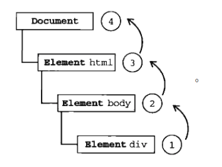
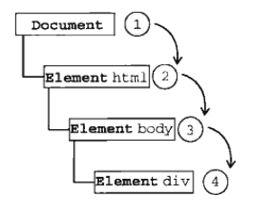
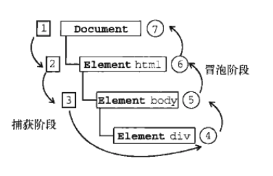
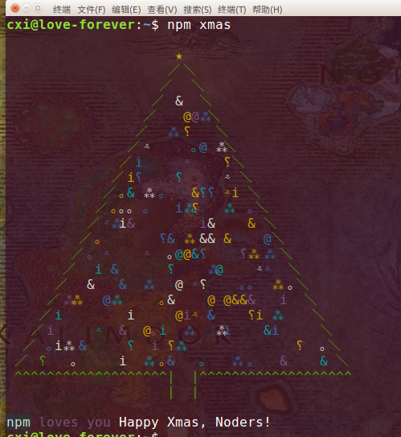

## 前言

#### 在讲事件处理之前先看看下面几点：

- 以下所说到的 ***IE*** 都是指 <code>*IE8* 以及更早期版本的 *IE* </code>
- 以下所说到的 ***IE*** 都是指 <code>*IE8* 以及更早期版本的 *IE* </code>
- 以下所说到的 ***IE*** 都是指 <code>*IE8* 以及更早期版本的 *IE* </code>

- 我们先了解 ***[EventTarget][1]*** ，<code>它一个接口，由一个可以接受事件的对象实现的; 同时也可以给它添加侦听器</code>。

- ***EventTarget***，可以是 *element* ， *document* ， *window* ， *XMLHttpRequest* 等等。

## 事件处理器和事件侦听器


### 事件处理器

  1. 它是通过是由 *DOM* 元素提供的 <code>*on{eventtype}*</code> 属性注册的函数。
  2. 它的作用：帮助管理元素如何对事件反应。

  ```
  // 这模式为 DOM 0级事件
  <div id="div1" onclick="alert('I am div1.')">Click me</div>

  或

  <div id="div1" onclick="click()">点我咯</div>

  <script>
    function click () {
      alert('I am div1.');
    }
  </script>

  // 点击之后都会有弹出 ‘I am div1 ’ 。
  // 缺点如下：
  // 第一种：把代码写在了 html 元素里面，简直灾难....
  // 第二种：他们之间有强耦合性，如果修改函数名，两个地方到哦要改。
  ```
  3. 同时也可以用 *js* ，帮 *DOM* 元素添加 ***on{eventtype}*** 。

  ```
  // 同样为 DOM 0级事件
  <div id="div1">快点我</div>

  <script>
    let div1 = document.getElementById('div1');
    div1.onclick = function () {
      alert('I am div1.');
    };
  </script>
  ```

### 事件侦听器

  1. 它是通过 ***EventTarget.addEventListener()注册的对象或函数。

  2. *EventTarget.addEventListener(**eventtype**, **listener**, **options**)*
      - **eventtype**： 事件类型，如 *click* ， *change* ， *focus* 等等 。可以点[这里][2]看看有哪些事件类型 。

      - **listener**： 它为一个函数。当监听的事件触发时，要执行什么操作。

      - **options**： 下面会说。
  3. *IE* 的话，则是：EventTarget.attachEvent(eventNameWithOn, listener)。 
      - **eventNameWithOn**： 这里的事件类型要带 ***on*** 。
  ```
  // DOM 2级事件

  <div id="div1">Click me</div>

  <script>

    let div1 = document.getElementById('div1');

    let fn = function () {
      alert('I am div1');
    };

    // 标准浏览器下写法
    div1.addEventListener('click', fn);
    
    // 如果 IE 下写法
    div1.attachEvent('onclick', fn);
  </script>
  ```

### 事件处理器和事件侦听器的不同

  1. **事件处理器**在同一个事件类型上不能绑定多个事件。而**事件侦听器**可以。

  ```
  // 第一个例子， 点击后会只弹出 1 。

  <div onclick="alert(1)" onclick="alert(2)">Click me</div>


  // 第二个例子， 点击只会弹出 2 。

  <div id="div1">Click me</div>
  
  <script>
    let div1 = document.getElementById('div1');

    div1.onlick = () => alert(1);
    div1.onlick = () => alert(2);
  </script>

  // 为何弹出不一样？这是因为生成DOM树和JS执行的方式不同。
  ```
  
  2. **事件处理器**内部的 <code>*this*</code> 关键字被设置为注册该事件处理器的 DOM 元素。 而**事件侦听器**则指向 *undefined* (严格模式下)。

## 事件捕获和事件冒泡

  1. 这里先说下 *addEventListener* 的第三个参数 ***options** 。

  2. ***options*** 有很多选择，点[这里][3]可以看。主要讲的是里面 ***useCapture***。
  3. ***useCapture*** 它是 *Boolean* 值。
      - *false* ： 默认值。事件会冒泡。
      - *true* : 事件会捕获。
  
  4. <code>注意：*IE* 下，只有冒泡，没有捕获。所以 *attachEvent* 没有第三个参数</code>
  
### 事件冒泡

##### 如果子元素和父元素都有事件处理程序，触发子元素的事件后，父级的事件跟着触发，就像在水里吐出气泡，再往上触发父级的父级事件。如上图
##### 注意了，他们的事件类型是一致才行！！！。

  

  - 事件处理器情况
  ```
  <div id="div1" onclick="alert(1)"  style="width:300px;height: 300px;background-color:red" >

    <div id="div2" onclick="alert(2)" style="width:200px;height: 200px;background-color:green">

      <div id="div3" onclick="alert(3)" style="width:100px;height: 100px;background-color:yellow"></div>

    </div>
  </div>
  // 点击div3,弹出的数字顺序是： 3 -> 2 -> 1 。
  ```
  - 事件侦听器情况
  ```
  <div id="div1" style="width:300px;height: 300px;background-color:red" >

    <div id="div2" style="width:200px;height: 200px;background-color:green">

      <div id="div3" style="width:100px;height: 100px;background-color:yellow"></div>

    </div>
  </div>
  <script>
    let div1 = document.getElementById('div1');
    let div2 = document.getElementById('div2');
    let div3 = document.getElementById('div3');

    let fn1 = () => alert('I am div1');
    let fn2 = () => alert('I am div2');
    let fn3 = () => alert('I am div3');

    // 标准浏览器下。
    div1.addEventListener('click', fn1, false);
    div2.addEventListener('click', fn2, false);
    div3.addEventListener('click', fn3, false);
    // 如果在 IE 下
    div1.attachEvent('click', fn1);
    div2.attachEvent('click', fn2);
    div3.attachEvent('click', fn3);
  </script>
  // 点击 div3 ， 弹出顺序：'I am div3' -> 'I am div2' -> 'I am div1'
  ```
  - 如果*事件处理器* 和 *事件侦听器* 都有呢，怎么执行？代码就不写了，其实就是上面的结合。答案如下：
  ```
  3 -> 'I am div3' -> 2 -> 'I am div2' -> 1 -> 'I am div1'
  因为DOM先生成，获取onclick，加载JS时，再注册监听事件。
  ```
### 事件捕获

##### 其实和事件冒泡差不多，只是先从父到子。

##### 注意了，他们的事件类型是一致才行！！！。

  

  - 代码其实跟上面差不多，就是 ***addEventListener()*** 第三个参数 *false* 改为 *true* 。
  ```
  div1.addEventListener('click', fn1, true);
  div2.addEventListener('click', fn2, true);
  div3.addEventListener('click', fn3, true);

  // 点击div3, 弹出的顺序为 'I am div1' -> 'Iam div2' -> 'I am div3'
  ```

## 事件流

##### 事件流又称为事件传播，*DOM*2级事件规定的事件流包括三个阶段：*事件捕获阶段*、*处于目标阶段*和*事件冒泡阶段*。

##### 首先发生的是*事件捕获*，为截获事件提供了机会。然后是实际的目标接收到事件，最后一个阶段是*冒泡阶段*，可以在这个阶段对事件做出响应。



- 由于 *addEventListener* 同一事件类型可以监听多个事件，如图：

  ```
  let div1 = document.getElementById('div1');
  let div2 = document.getElementById('div2');
  let div3 = document.getElementById('div3');

  let fn1 = () => alert('I am div1');
  let fn2 = () => alert('I am div2');
  let fn3 = () => alert('I am div3');

  div1.addEventListener('click', fn1, true);
  div1.addEventListener('click', fn1, false);

  div2.addEventListener('click', fn2, true);
  div2.addEventListener('click', fn2, false);

  // 如果 处于目标阶段，有没 true 和 false 都一样的了。
  // 如果点击的是 div3 ，可写成 div3.addEventListener('click', fn3)
  div3.addEventListener('click', fn3, true);
  div3.addEventListener('click', fn3, false);
  ```
- 点击 div3, 执行顺序：
  ```
  'I am div1' -> 'I am div2' -> 'I am div3' -> 'I am div2' -> 'I am div1' 。
  ```

## 阻止事件冒泡和事件捕获

1. 触发事件程序，函数内都可以获取一个事件对象 ***event*** ，而 *IE* 的事件对象是 ***window.event*** 。

2. ***event*** 对象有个方法 ***stopPropagation*** ， 它可以阻止事件冒泡和捕获。

3. 而 *IE* 的 ***window.event*** 有个 ***cancelBubble*** 方法，组止冒泡。

```
  // 部分关键代码
  let fn1 = () => alert('I am div1');

  let fn2 = () => {
    alert('I am div2');
    event.stopPropagation();

    // IE 是 window.event.cancelBubble()，当然下面addEventListener 改为 attachEvent。
  }

  let fn3 = () => alert('I am div3');

  div1.addEventListener('click', fn1, true);
  div1.addEventListener('click', fn1, false);

  div2.addEventListener('click', fn2, true);
  div2.addEventListener('click', fn2, false);

  div3.addEventListener('click', fn3, true);
  div3.addEventListener('click', fn3, false);
```
点击 div3,执行顺序：'I am div1' -> 'I am div2' 。
1. 如果有事件捕获和冒泡，则先执行事件捕获（ 上面有说 ）。所以先弹出 ' I am div1' 。

2. 由于 *fn2* 里面有 ***event.stopPropagation()*** ，阻止捕获和冒泡，所以弹出 'I am div2'，之后就没了。

## 默认事件

- 当我们点击链接，会跳到新的加载页面，当我们完成 *input* 的按回车，就会提交。 等等这些都是元素的默认事件。

- 但不是所有元素都有默认事件的。可以根据 该元素的事件对象 *event* 的 *cancelable* 值来判断， **false** 则没有默认事件。

## 阻止默认事件

- 我们可以通过 ***event.preventDefault*** 阻止默认事件，*IE* 的是 ***window.event.returnValue*** 。

- *阻止默认事件* 不在 **事件流** 当中的，当然也不会影响冒泡和捕获。

```
<a id="test" href="www.baidu.com">百度</a>

<script>
  let test = document.getElementById('test');

  let fn = () => {
    event.preventDefault();

    // IE 下: window.event.returnValue = false;
  }

  // 标准浏览器下
  test.addEventListener('click', fn);

  // IE 下的话
  test.attachEvent('onclick', fn);
</script>
```
点击之后，不会跳转到百度哦。

--------------------------
## 最后

虽然现在 *MVVM* 框架是主流，但基础的东西还是要理解透。如果写一个原生的组件时候，那么这些会涉及到的。
在此祝大家冬至快乐！也提前说声圣诞快乐！
  




[1]: https://developer.mozilla.org/en-US/docs/Web/API/EventTarget
[2]: https://developer.mozilla.org/zh-CN/docs/Web/Events
[3]: https://developer.mozilla.org/zh-CN/docs/Web/API/EventTarget/addEventListener