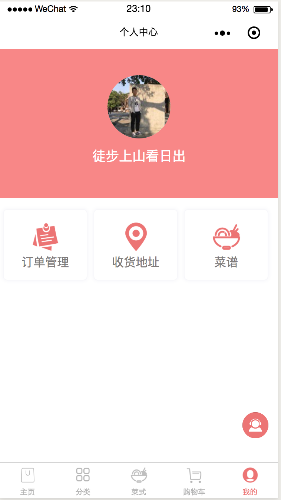

# 个人简历

## 基本资料

<table>
  <tr>
    <td><b>姓名</b></td>
    <td>林晨希</td>
    <td><b>电话</b></td>
    <td>13727780731</td>
  </tr>
  <tr>
    <td><b>邮箱</b></td>
    <td>dream_cxi@163.com</td>
    <td><b>目前所在城市</b></td>XiXiArthurs_X1XiXiArthurs_X1XiXiArthurs_X1XiXiArthurs_X1XiXiArthurs_X1
    <td>广东东莞</td>
  </tr>
  <tr>
    <td><b>毕业时间</b></td>
    <td>2017</td>
    <td><b>毕业学校</b></td>
    <td>佛山职业技术学院</td>
  </tr>
  <tr>
    <td><b>学历</b></td>
    <td>大专</td>
    <td><b>专业</b></td>
    <td>物联网应用技术</td>
  </tr>
</table>
  

## 自我描述

1. 熟悉掌握 `html` 和 `css` 。
2. 熟悉掌握 `javascript` 且对 `ES6` 熟练使用。
3. 熟悉 `html` 规范，语义性，各浏览器的兼容性。
4. 熟悉 **http协议** 和 了解 **osi网络模型** 的工作原理。
5. 熟悉前端工具：`webpack` ，`babel` 等。
6. 熟悉 *css* 预处理器：`scss` ，`less` ，`postcss`。
7. 了解 *mv** 的框架模式，且熟练使用 `vue` 。
8. 熟悉 `node` 的运用和操作。
9. 熟悉使用 **git** 和 **Linux** 。
10. 常逛 *segmentfault* 社区，有自己的[博客][2]。
11. 平时喜欢看书，学习，运动。

## 项目
  
### 同城配送小程序
- 用了百度地图的范围逻辑计算函数判断自定义的区域范围。
- 部分业务功能：甲方的订单管理和评价回复。
- 实现不同的等级会员，商品会显示不同的价格

###  周报系统  
- 根据当前日期获取当前周，并进行填写。
- 不同的项目经理只能看自己项目组的周报。
- 项目工时统计。
- 上周未填周报的成员会在登录后受到提示。

## 工作经历

### 2017.05 ～2017.09  深圳市世界货科技有限公司
1. 对企业的商家系统平台，客户系统平台的模块，功能，页面效果进行开发。
2. 修复这些平台的 **bug** 。
3. 完善客户的体验和需求。
4. 开发 *restful* 服务器的接口，且把 `express` 框架换成 `restify` 框架。
5. 所用技术：`angular1.x` ，`angular material`，`mocha` ，`express` ，`node` ，`mongodb` 。

![部分照片][1]

### 2017.10～2018.02 东莞东家家具
1. 担任前端组长，负责内部系统的设计和搭建。
2. 分配任务，分模块开发，复用组件开发。
3. 负责部门响应式官网开发。
4. 所用技术：`VUE全家桶` ，`webpack` ，`babel` ，`scss` ，`node` ，`饿了么UI组件库` 。

![东家后台图片][3]
![东家后台图片_2][4]

### 2018.03～至今
1. 担任前端开发工程师，参与需求调研和分析，负责系统的整体设计和搭建。
2. 主要制作大数据分析应用系统，用作数据可视化大屏展示。
3. 所用技术：`VUE全家桶` ，`webpack` ，`babel` ，`scss` ，`node` ，`Iview UI组件库`，`Typescript`，`Echarts4.0`，`百度地图`  

***由于都是政府项目，没有图片***

[1]: shijiehuo.png
[2]: https://segmentfault.com/blog/bepromising-sgf
[3]: MD.png
[4]: md_2.png
